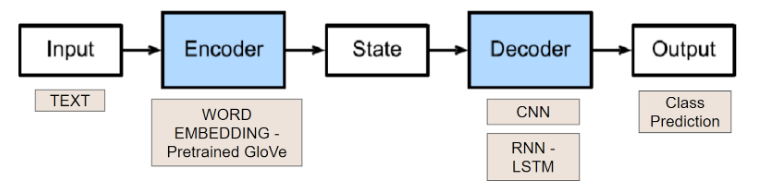
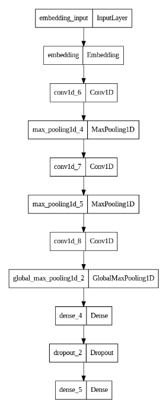
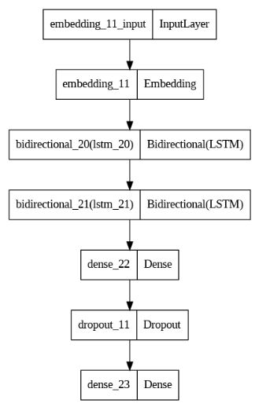
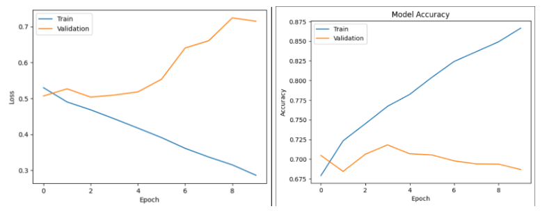
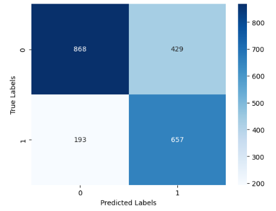
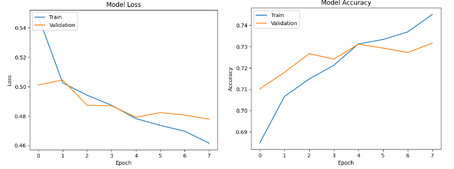
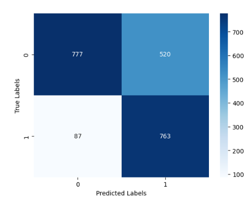
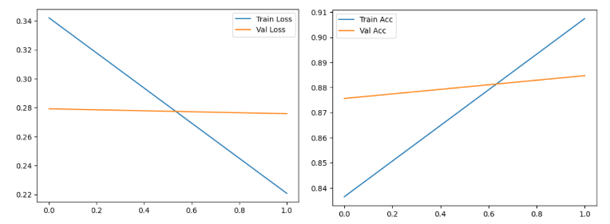
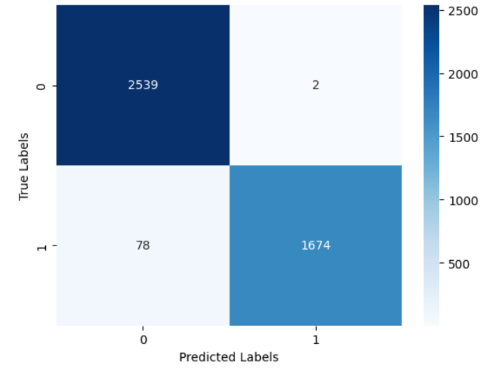

# AI Text Detection
ECGR 4106/5106 (Real Time Machine Learning) final project under the supervision of Dr. Hamed Tabkhi. This project aims to classify the origin of a tweet as an AI generated text or a human written one.

Due to the rise of high-level and easily accessible natural language processing (NLP) models such as OpenAI’s GPT or Google’s Bard, there has been a rising concern that the technology will be used in negative ways, such as plagiarism or the generation of misinformation. Particularly with misinformation, there is a real danger in the domain of both news and politics, as a model could be trained for tasks such as writing a fake news article, or even a fake speech from an important figure, such as a global leader. 

As social media such as Twitter or Facebook  behaves as a large gathering place online, it poses itself as a prime target for the dissemination of such misinformation. One way to combat this would be the development of a methodology to generate a text authentication system, which can quickly and accurately determine whether a text is a genuine human creation, or an AI generated text.

## Dataset and Data Preporcessing
a “Twitter deep fake” dataset was obtained from Kaggle, called TweetFake (https://www.kaggle.com/datasets/mtesconi/twitter-deep-fake-text). The TweetFake dataset includes 25,000 tweets, split evenly between human and bot classes. It also includes columns for “screen name,” which is the Twitter username, and “class type,” which defines the type of model being used as human, GPT-2, RNN, or others.
Initial inspection of the original dataset revealed a stark contrast between the quality of RNN generated texts vs the other models which led to all the RNN class data points being removed. The Folder 'Data' includes the three original train, validation, and test csv files as well as the outputted csv file which combines all the data and applies all cleaning and preprocessing.

The csv file that includes cleaned up data points was then tokenized before being split back into training, validation, and testing datasets. For tokenization, the built-in Keras tokenizer was used for all trained models. Due to Twitter having a 240-character limit on tweets, including spaces, a max sequence length of 100 tokens was chosen, as a full-length 240 character tweet consisting of only 3 letter words would be 60 tokens long. This scenario likely is an edge case, with a higher number of tokens than typical, signifying that this sequence length could potentially be tuned down. However, the max sequence any tweet could possibly need would be larger, at 120 tokens, with a tweet consisting of 120 single characters followed by spaces.

## Approach 1: Word Embedding
The first approach taken to resolve this problem and achieve the desired results involved following the common encoder-decoder architecture as shown below. The Encoder portion of the architecture in this approach is the word embedding, and in the case of this project the Global Vector (GloVec) was used. The pretrained GloVec encoded each token into a vector representation with a preset dimension of a hundred. The output vector representation is then passed onto the decoder, which in this project acted as the classifier. 

Two different classifier models were explored to act as the decoder. The first is a CNN model with an architecture shown below. The model is made out of three convolution layers, max pooling layers in between, dropout to help with generalization, and lastly a few dense layers.

The second classifier utilized an RNN where two bidirectional LSTMs were stacked. The architecture can be seen in Figure 3 below. This model also utilized dense and dropout layers but max pooling was excluded. 

## Approach 1 Results - CNN Classifier

## Approach 1 Results - RNN Classifier

## Approach 2: BERT Transformer
For the second approach the team wanted to explore using transformers to tackle this problem. The team used a pre-trained BERT word embedding model in order to get the tokens embedded in a format fit for the bert model. Three different levels of embeddings were used: The Tokens Embedding used the BERT embedder discussed earlier, the segment embedding grouped words belonging to the same sentence, and the position embedding add value to the vectors influenced by the position of each word in the sentence. 

The pretrained BERT model used is the base BERT with 110 million parameters and it includes 12 Transformer Encoders stacked upon one another. A linear layer was then added at the end of the BERT model to serve as the classifier. The model was then trained on our dataset, where the BERT model was fine tuned and the Linear Layer classifier was trained. 

## Approach 2 Results

